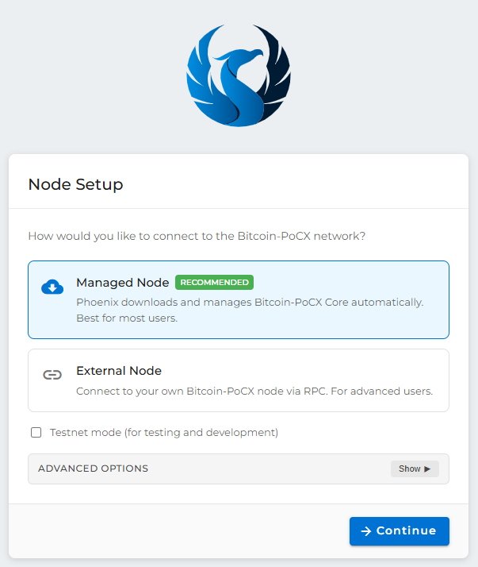

# Phoenix Wallet — User Handbook

Source files for the Phoenix Wallet User Handbook. The handbook is written in Markdown (one file per chapter) and built into a single PDF using Pandoc + xelatex.

## Prerequisites

- **Pandoc 3.0 or newer** — <https://pandoc.org/installing.html>
- **A LaTeX distribution** that provides `xelatex`:
    - Windows: [MiKTeX](https://miktex.org/) (auto-installs missing packages on first build)
    - macOS: [MacTeX](https://www.tug.org/mactex/)
    - Linux: `texlive-xetex texlive-fonts-recommended texlive-latex-extra`

## Building the PDF

From the `handbook/` directory:

    .\build.ps1

The output is written to `../handbook.pdf` (the repository root). The first build under MiKTeX takes longer because it downloads several LaTeX packages on demand.

## Source revision

The handbook documents a specific build of the wallet. The commit it is
currently based on — and the procedure for updating it against a newer build —
is recorded in [`BASED-ON.md`](BASED-ON.md). Update that file whenever you sync
the handbook to a new wallet revision.

## Project layout

    phoenix-pocx-handbook/
    ├── chapters/          one Markdown file per chapter or part divider
    ├── images/processed/  screenshots referenced by the chapters
    ├── metadata.yaml      title, version, fonts, page setup
    ├── style.tex          LaTeX header includes (page numbers, header bar)
    ├── build.ps1          PowerShell build script
    └── README.md          this file

## Editing conventions

- One file per chapter under `chapters/`. Filenames use the prefix `chNN-…` so they sort naturally.
- Part dividers (`part1.md`, `part2.md`, …) each contain a single LaTeX `\part{…}` command.
- The build script lists every input file explicitly. To add a new chapter, append it to the `$inputs` array in `build.ps1`.

### Screenshots

Screenshots live in `images/processed/` and are referenced from the chapters with a standard Markdown image plus a width hint, for example:

    {width=70%}

Use the chapter prefix (`chNN-…`) in the filename to keep image assets grouped with their chapter.

### Callouts

Callouts are written as blockquotes with a leading bold tag. Three variants are used throughout the handbook:

    > **Tip** — A helpful suggestion.

    > **Note** — Useful background information.

    > **Warning** — An action that can cause loss of funds or data.

### Text styles

- **Bold** for names of buttons, fields, menus, and on-screen labels.
- `Monospace` for file paths, commands, and exact text the user types.
- *Italics* for new terms when first introduced.

## License

The handbook is distributed alongside Phoenix under the GPL-3.0 licence. See `LICENSE` in the wallet repository for details.
